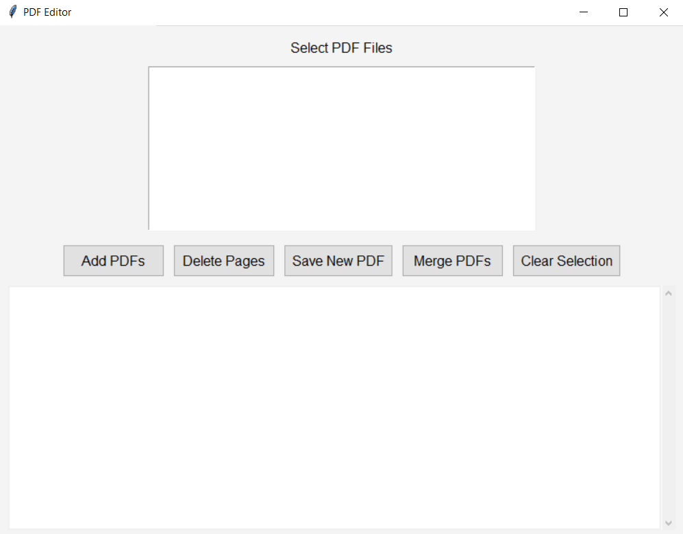
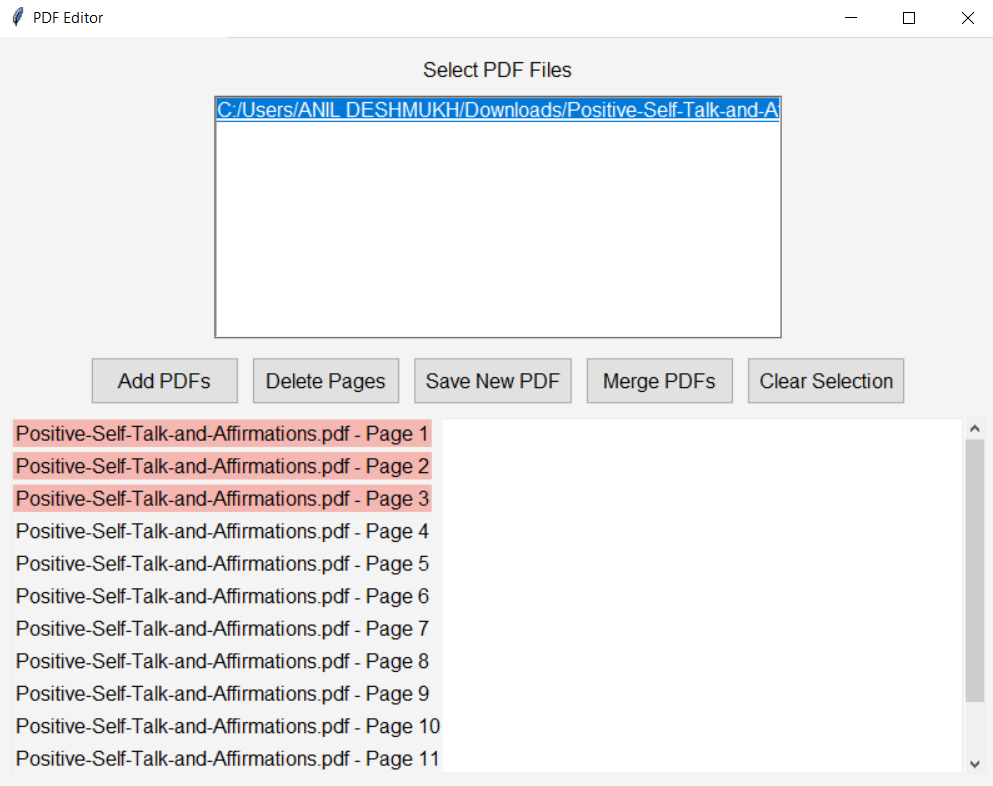

# PDF Editor 📝

PDF Editor is a user-friendly desktop application for managing PDF files. With this app, you can easily add PDFs, delete selected pages, merge multiple PDFs into one, and save your changes. Designed with a modern UI, it provides a seamless experience for organizing your PDF documents.

## Features

- **Add PDFs 📥**: Load multiple PDF files into the application.
- **Delete Pages ❌**: Select and remove specific pages from your PDFs.
- **Merge PDFs 🔗**: Combine multiple PDFs into a single document.
- **Save Changes 💾**: Save the edited PDF or merged document.

## Installation

1. **Clone the repository**:
    ```bash
    git clone https://github.com/SnehaDeshmukh28/Basic-PDF-Editor
    ```
2. **Navigate to the project directory**:
    ```bash
    cd PDF-Editor
    ```
3. **Install the required packages**:
    ```bash
    pip install PyPDF2 tk
    ```

## Usage

1. **Run the application**:
    ```bash
    python pdf_editor.py
    ```
2. **Splash Screen 🎬**: The app will start with a splash screen and then transition to the main PDF editor interface.

3. **Upload PDFs**: Use the "Add PDFs" button to select PDF files.

4. **Manage Pages**:
    - **Select Pages**: Click on page labels to select or deselect them.
    - **Delete Pages**: Click "Delete Pages" to remove selected pages.

5. **Save or Merge**:
    - **Save New PDF**: Click "Save New PDF" to save the changes.
    - **For Merge PDFs**: Click "Add PDFs" to add and select the ones to merge.
    - **Merge PDFs**: Click "Merge PDFs" to combine selected files into a new PDF.

## Example

1. **Home Screen**:

    

2. **Delete Functionality**:

    

## License

This project is licensed under the Apache License, Version 2.0. See the [LICENSE](LICENSE) file for more information.

## Contact

For any questions or support:

- **Name**: Sneha Deshmukh | [deshmusn@gmail.com](mailto:deshmusn@gmail.com)
- **GitHub**: [SnehaDeshmukh28](https://github.com/SnehaDeshmukh28)

---

Thank you for using PDF Editor! We hope it helps you efficiently manage your PDF documents.